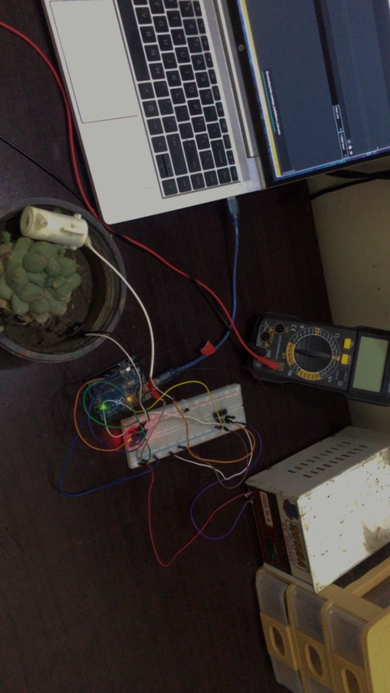

# PlantWateringSystem
This is a Simple Plant watering system which is solar powered 

* Component Lists:

1. Solar 5v 1Amps
2. Water Pump
3. L293d Driver
4. Esp8266 Replaced with Arduino afterwards 
5. Soil Moisture Sensor

### Initial Thoughts:

So My plan Was to use a transisotor (2n2222 NPN) to run the Motors Because neither ESP and UNO can handle the Load 
What i was gonna do is get the Soil Moisture and then upon certian threshold value i run the motor by giving some Base current using the digital Pins to the NPN and it should have worked but it did not 

# Transistor Problems:

So my transistor was not working i first though its broken tested it with an LED and it did work but still it wasnt working with the Motor 

*My Initial Thoughts on the Problem*
I thought that the Base could not get current enough for the transisotr to fully become conductive and give out the AMPS needed by motor, But after getting help from Discord "Official Arduino Server" I found that 2n222 isnt cut for it 

# Using L293d Motor Driver 

I was gonna buy a new Transistor but but i did not wanted to go and buy a new one was very lazy for it hehe
Then i though i have a Driver laying around so i used it and to my surprise *Drum Rolls* it didnt work :) 

# Debugging the Circuit 

After a lot of Tries and looking the circuit *staring at it* I found out that i did not common the ground *cries in pain* 🙂
 I common the Ground and it started working 

# Final Thoughts:

I wanted to do a lot more on this but my main thing was done i got it working but i could not test it fully with solar so i did test it using my supply and here is the Final Project Picture:

*if the Image looks crappy I am sorry was not planning on writing about it so yea*

Thanks for Reading Have a Good day !!
